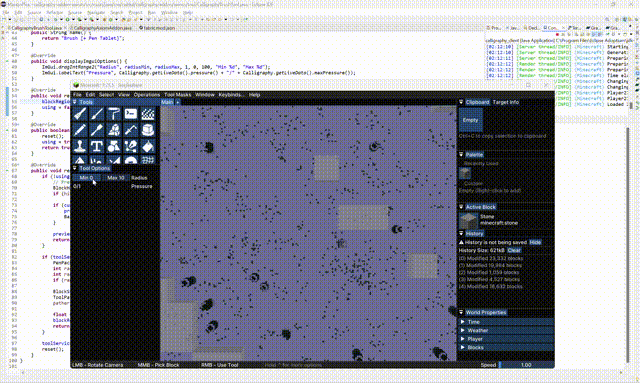

# Calligraphy
The pen tablet Minecraft mod.

## Addons
Addons are always included inside the main mod. However, they are not loaded by Fabric Loader when you don't have required mod installed.

Calligraphy include addons for the following mods:

### Axiom (in development)

Calligraphy Axiom Addon introduce tools for sculpting the terrain.

- [ ] Draw (sorta finished)
- [ ] Smooth & Scrape (need to learn more about client API)

### WorldEdit (coming soon in the distant future)
Calligraphy WorldEdit Addon allows you to use your WorldEdit brush with pressure-sensitive pen tablet. The client would actively sending pressure data to server over plugin messaging channel, and the server plugin/mod would change the size of the brush based on how hard you press your pen.

## Build Calligraphy
### Windows
- Requires Visual Studio C++ tools

### Linux
- Requires GCC toolchain

### All OSes
- Get Java Development Kit 21.
- Clone this repository.
- Build with `./gradlew build`.
- Grab the mod in `build/libs/`. The one without `-sources` is what you probably want.

## Compatibility
### Architecture
Only support x86_64 for now. ARM64 is planned for distant future (when I have a Windows ARM device).

### Operating systems
- Windows: Supported! (using Windows Ink)
- Linux: Not supported yet. If you want to add support for Linux, consider open a new PR. `linux/input.h` is preferred. Only consider OpenTabletDriver when there is no other option.
- MacOS: Not supported yet. No standard/official API for MacOS at this moment (and I don't have a Mac either).

# License
MIT License. See [LICENSE](LICENSE) for legal document.